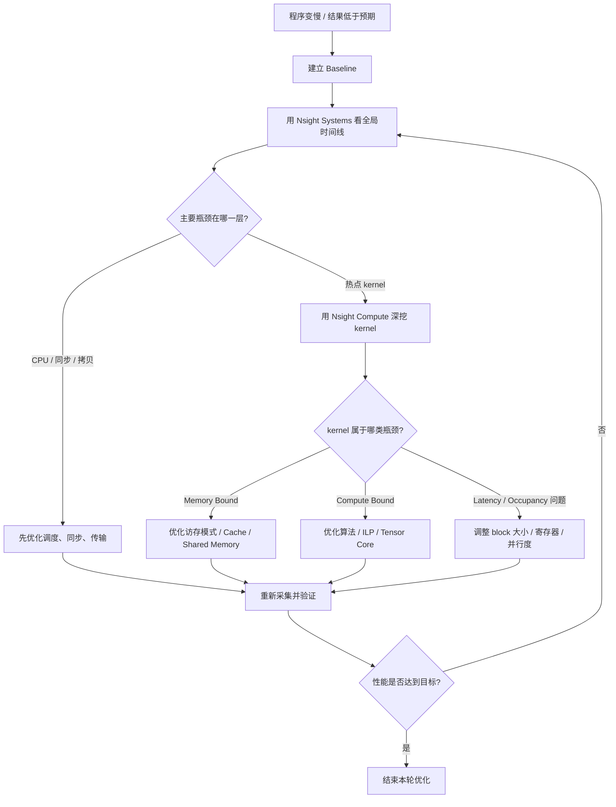
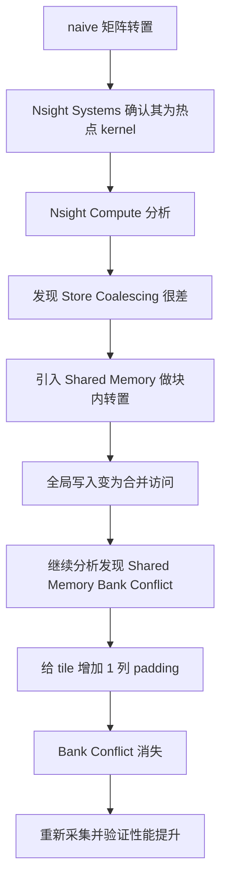
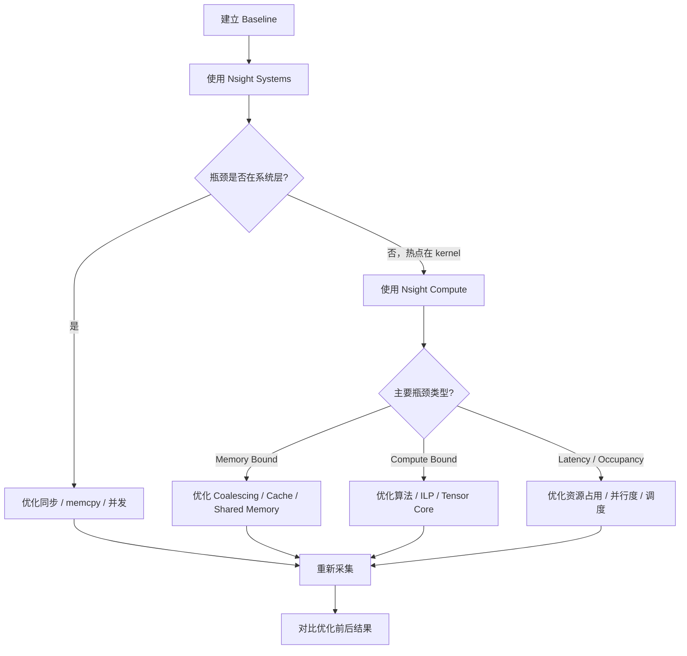

# CUDA 性能分析实战：Nsight Systems和Nsight Compute入门

> **系列**：CUDA修仙之路  
> **难度**：⭐⭐⭐ (1-5星)  
> **前置知识**：第5篇 - 第一个CUDA程序，第6篇 - SIMT执行模型  
> **预计阅读时间**：28分钟  
> **配套代码**：[GitHub链接](https://github.com/Mark930209/DaoOfCUDA)

---

## 引子：为什么有这篇性能分析？
**优化！优化！还是特么的优化！**
**快！快！要的就是特么的快！**

很多时候，用CUDA写一个计算程序并不复杂，但是大多数情况下，我们写的CUDA程序，很慢很慢，甚至让人怀疑，为什么一定要用CUDA，直接CPU算，可能还快点。前面已经讲了很多原理上的东西，告诉你理论上最优的方案是啥，但实际应用中，我们还是需要去有针对性地分析CUDA程序的瓶颈。此外，后续的篇章中，会有很多进阶的代码，这些也是需要有一定的性能分析基础才能吃透的。

让我们从下面这个kernel函数开始：

```cuda
__global__ void my_kernel(float* data, int n) {
    int i = blockIdx.x * blockDim.x + threadIdx.x;
    if (i < n) {
        data[i] = expensive_computation(data[i]);
    }
}
```

程序跑起来以后，你可能只知道一件事：**它很慢**。

但“慢”其实有很多种：

- GPU 大部分时间都在空闲；
- CPU 提交 kernel 太碎，启动开销过大；
- Host ↔ Device 拷贝太频繁；
- 某个 kernel 真正成了热点；
- kernel 本身又可能是：
  - 内存受限；
  - 计算受限；
  - 并行度不足；
  - Shared Memory 冲突严重；
  - Warp stall 太多。

如果没有分析工具，优化这件事很容易退化成“拍脑袋调参”。

所以我们需要使用 `Nsight Systems` 和 `Nsight Compute` 建立一套标准的性能分析工作流：

1. **先建立 Baseline**，知道“现在到底多慢”；
2. **先用 Nsight Systems 看全局**，确认瓶颈是在 CPU、拷贝还是 GPU；
3. **再用 Nsight Compute 看关键 kernel**，确认它为什么慢；
4. **最后结合 Roofline 和源码视图**，决定优化方向；
5. **优化后重新验证**，而不是只看一次结果。

---

## 1. 先建立正确心智模型：这两个工具各自解决什么问题？

### 1.1 `Nsight Systems` 解决的是“时间花到哪里去了”

`Nsight Systems` 是**系统级性能分析工具**，重点在“全局视角”。

它适合回答这类问题：

- CPU 在干什么？
- GPU 在忙什么？
- 有没有大段空闲时间？
- 数据传输是不是拖了后腿？
- kernel 是否太碎、启动是否过于频繁？
- 多个 stream 到底有没有形成真正的 overlap？

你可以把它理解为：

> **先看整条生产线，再决定要不要拆开某台机器。**

### 1.2 `Nsight Compute` 解决的是“这个 kernel 为什么跑不快”

`Nsight Compute` 是**kernel 级性能分析工具**，重点在“单个热点内核的微观诊断”。

它适合回答：

- 这个 kernel 是 memory bound 还是 compute bound？
- Occupancy 是否足够？
- Warp stall 主要卡在什么地方？
- 全局内存访问是否合并？
- Shared Memory 有没有 bank conflict？
- 哪一段源码、哪几条 SASS 指令最值得关注？

### 1.3 正确顺序几乎永远是：**先 Systems，后 Compute**

如果你只记住这篇文章里的一句话，那应该就是下面这一句：

> **不要一上来就开 `Nsight Compute`。**

如果你连程序的大头时间耗在哪里都还没确认，直接去看单个 kernel 的几十项指标，往往只会把自己淹没在数据里。

### 1.4 一张图看懂完整工作流



---

## 2. 先做 Baseline：没有基线，优化没有意义

很多性能分析文章一上来就讲工具，但实际项目里，**Baseline 比工具本身更重要**。

> **注：**本文配套的示例代码已经放在github仓库对应章节的 `code/` 目录里，后面看到的 baseline、timeline 和矩阵转置案例都可以直接在本地复现。

### 2.1 Baseline 至少记录这几项

- 输入规模，例如 `N=1<<24`；
- GPU 型号、驱动版本、CUDA 版本；
- 编译选项，例如是否开启 `-O3`、是否加 `-lineinfo`；
- 程序总时间；
- 关键 kernel 的单次时间；
- 是否做了预热；
- 是否多次运行取均值。

> **同一段 CUDA 代码，在不同输入规模、驱动版本、是否预热的情况下，结果都可能明显不同。**

### 2.2 一个简单但实用的 Baseline 示例

下面这段代码不是“优化代码”，而是为了让性能测量更可靠：

> 完整可编译版本已放到 `code/profile_demo.cu`，这里保留核心片段便于讲解。

```cuda
#include <cuda_runtime.h>
#include <iostream>
#include <vector>

__global__ void saxpy(float a, const float* x, const float* y, float* out, int n) {
    int i = blockIdx.x * blockDim.x + threadIdx.x;
    if (i < n) {
        out[i] = a * x[i] + y[i];
    }
}

int main() {
    const int n = 1 << 24;
    const size_t bytes = n * sizeof(float);

    std::vector<float> h_x(n, 1.0f), h_y(n, 2.0f), h_out(n);
    float *d_x, *d_y, *d_out;
    cudaMalloc(&d_x, bytes);
    cudaMalloc(&d_y, bytes);
    cudaMalloc(&d_out, bytes);

    cudaMemcpy(d_x, h_x.data(), bytes, cudaMemcpyHostToDevice);
    cudaMemcpy(d_y, h_y.data(), bytes, cudaMemcpyHostToDevice);

    int block = 256;
    int grid = (n + block - 1) / block;

    // 预热：避免把首次初始化/JIT 开销算进正式结果
    saxpy<<<grid, block>>>(2.0f, d_x, d_y, d_out, n);
    cudaDeviceSynchronize();

    cudaEvent_t start, stop;
    cudaEventCreate(&start);
    cudaEventCreate(&stop);

    cudaEventRecord(start);
    for (int i = 0; i < 20; ++i) {
        saxpy<<<grid, block>>>(2.0f, d_x, d_y, d_out, n);
    }
    cudaEventRecord(stop);
    cudaEventSynchronize(stop);

    float ms = 0.0f;
    cudaEventElapsedTime(&ms, start, stop);
    std::cout << "Average kernel time: " << ms / 20.0f << " ms\n";

    cudaMemcpy(h_out.data(), d_out, bytes, cudaMemcpyDeviceToHost);

    cudaFree(d_x);
    cudaFree(d_y);
    cudaFree(d_out);
    cudaEventDestroy(start);
    cudaEventDestroy(stop);
    return 0;
}
```

### 2.3 为什么要先预热？

因为第一次运行时，可能夹杂了：

- CUDA 上下文初始化；
- JIT 编译；
- 缓存尚未稳定；
- Runtime 额外初始化逻辑。

如果你把这些一次性开销和 steady-state 性能混在一起，后面的分析往往就会偏掉。

---

## 3. 第一层：用 `Nsight Systems` 找系统级瓶颈

### 3.1 什么时候优先用 `Nsight Systems`

只要你还不确定瓶颈在什么层，就先开它。典型场景包括：

- 整个程序慢，但不知道慢在哪；
- GPU 利用率不高；
- 怀疑 Host ↔ Device 拷贝太多；
- 多 stream 程序看起来没有真正并发；
- kernel 数量很多，不知道该先分析哪个。

### 3.2 最新版安装与版本信息

根据 NVIDIA 最新公开页面，`Nsight Systems` 下载页已经按**日期版本**组织，例如：

- `2026.1.2`
- `2026.1.1`
- `2025.6.1`

这意味着你的文章里最好避免写死某个旧 Toolkit 绑定版本，而应该强调：

> 使用前先确认下载页上的**最新版本号、目标平台、host/target 关系**。

一些和本文相关的新版变化：

- 支持 `CUDA 13.2`；
- `GPUDirect Storage Metrics` 已进入可用范围；
- Windows 图形场景新增/强化了 `WDDM Memory Trace`；
- 旧式 `text/json export` 已逐步退场，更推荐 `sqlite` 或 `jsonlines`。

### 3.3 `host` 和 `target` 别再搞混

- **host**：你打开 GUI、控制采集、查看报告的机器；
- **target**：真正运行被分析程序的机器。

最常见的两种情况：

1. **本机分析本机程序**：host 和 target 是同一台机器；
2. **Windows 本地 GUI 分析 Linux 服务器**：Windows 是 host，Linux 是 target。

### 3.4 最小可用命令行示例

先给读者一个最小工作流：

```bash
# 最简单的一次采集
nsys profile -o report ./my_program
```

如果你只想先看 CUDA + NVTX，不想把 CPU 采样也加进来，可以先简化成：

```bash
nsys profile --trace=cuda,nvtx --sample=none --cpuctxsw=none -o report ./my_program
```

如果你的程序本身有多个阶段，建议尽早使用**聚焦采集**：

- `cudaProfilerStart()` / `cudaProfilerStop()`
- 或者 NVTX range 作为 capture range

例如：

```bash
nsys profile -c nvtx -p profile_range@main -o report ./my_program
```

这类写法的意义在于：

> **只采你关心的那段时间，减少噪声，也减少报告体积。**

### 3.4.1 本文配套示例建议怎么跑

如果你想直接复现本文中的分析流程，可以先按下面的顺序来。

#### 第一步：编译配套代码

```bash
nvcc -O3 -lineinfo -o profile_demo.exe code/profile_demo.cu
nvcc -O3 -lineinfo -o transpose_demo.exe code/transpose_demo.cu
```

其中：

- `profile_demo.exe` 用于演示 baseline 与 `Nsight Systems` 时间线；
- `transpose_demo.exe` 用于演示矩阵转置三版本与 `Nsight Compute` 对比分析。

#### 第二步：先跑系统级分析

```bash
nsys profile -o profile_demo_report ./profile_demo.exe
```

建议优先看：

- GPU 是否有明显空洞；
- 小 kernel 是否过于碎片化；
- 是否存在频繁同步。

#### 第三步：再跑 kernel 级分析

```bash
ncu -o transpose_demo_report ./transpose_demo.exe
```

如果你希望更聚焦某一个版本，也可以分别分析：

```bash
ncu --kernel-name transpose_naive -o transpose_naive_report ./transpose_demo.exe
ncu --kernel-name transpose_shared -o transpose_shared_report ./transpose_demo.exe
ncu --kernel-name transpose_optimized -o transpose_optimized_report ./transpose_demo.exe
```

> 更完整的说明可参考 `code/README.md`。

### 3.5 Timeline 不是“看着热闹”，而是按层排查

读 `Nsight Systems` 的顺序，建议固定成下面四步。

#### 第一步：先看 GPU 有没有干活

先问一个最基本的问题：

> GPU 在大部分时间里是忙着，还是闲着？

如果 timeline 上 GPU 区域有明显空洞，说明问题未必在 kernel 本身，而可能在：

- CPU 提交不及时；
- 频繁同步；
- 数据传输阻塞；
- kernel 太碎、启动过于频繁。

#### 第二步：再看 CPU 在干什么

CPU 线程里常见要看的是：

- CUDA API 调用是否密集；
- 是否频繁出现同步调用；
- 主线程是否存在长时间串行准备逻辑。

#### 第三步：看 memcpy 和 kernel 的相对位置

很多“GPU 不够忙”的原因，本质上不是算慢，而是：

- H2D → kernel → D2H 完全串行；
- 每次只处理很小一批数据；
- 没有使用 stream overlap。

#### 第四步：确认是否需要进入 `Nsight Compute`

只有当你确认：

- 某个 kernel 确实耗时占比高；
- 且程序的大问题不是 CPU、同步、拷贝；

这时再进入 `Nsight Compute` 才最划算。

### 3.6 一段形象的“问题代码”

下面这段代码就很适合拿来讲为什么 GPU 利用率会低：

```cuda
for (int i = 0; i < 1000; i++) {
    small_kernel<<<1, 256>>>(data);
    cudaDeviceSynchronize();
}
```

它的问题不是 kernel 一定写得差，而是：

- kernel 太小；
- 启动次数太多；
- 每次都同步，GPU 和 CPU 基本失去 overlap。

更合理的改法通常是先减少碎片化：

```cuda
large_kernel<<<1000, 256>>>(data);
cudaDeviceSynchronize();
```

### 3.7 看到什么现象，就先怀疑什么

| Timeline 现象 | 初步判断 | 下一步 |
|---|---|---|
| GPU 有大段空闲 | CPU 喂不饱 / 同步过多 | 看 CPU 线程和 CUDA API |
| memcpy 占比很大 | 数据传输成瓶颈 | 批处理、Pinned Memory、Async Copy |
| kernel 很碎 | launch overhead 高 | 合并 kernel / 增大批次 |
| 多 stream 仍串行 | 流使用方式有问题 | 检查依赖、默认流、同步点 |
| GPU 一直很忙，但总时间仍长 | 热点 kernel 真慢 | 进入 `Nsight Compute` |

> **截图建议**：
> 1. 建议在 `nsys-ui` 中截取一张真实的 Timeline 总览图；
> 2. 再各截一张“GPU 空闲明显”和“memcpy 串行严重”的图；
> 3. 如果你给代码加了 NVTX，也建议补一张带 NVTX 范围标记的图。  
> 如果暂时没有真实截图，这一节先保留文字，后续在软件里实际跑一次示例程序后补图最稳妥。

---

## 4. 第二层：不要分析所有 kernel，只分析真正值得优化的热点

这是很多初学者最容易踩的坑。

`Nsight Systems` 打开以后，你往往会看到很多 kernel 名称，但并不是每一个都值得优化。

### 4.1 先挑热点，再做微观分析

优先分析满足以下条件的 kernel：

1. **总耗时占比高**；
2. **调用次数多**；
3. **输入规模稳定、容易复现**；
4. **优化后对整体性能有意义**。

### 4.2 一个很常见的误区

有些 kernel 单次时间很长，但只跑一次；
有些 kernel 单次很短，但会跑几百万次。

性能分析时，应该优先问：

> **谁对总时间贡献最大？**

而不是：

> **谁看起来最复杂？**

### 4.3 从 `Nsight Systems` 跳到 `Nsight Compute` 的思路

建议你在文章里明确写出这个动作链：

1. 在 `Nsight Systems` 中确认热点 kernel；
2. 记录 kernel 名称、调用阶段、输入规模；
3. 只对这个 kernel 做 `ncu` 分析；
4. 避免一次抓全量，减少数据噪声。

> **截图建议**：这里建议补一张热点 kernel 排序或时间占比的真实界面截图。如果没有，可在后续补图阶段从 `Nsight Systems` 的 summary/timeline 中截取。

---

## 5. 第三层：用 `Nsight Compute` 深挖单个 kernel

### 5.1 `Nsight Compute` 主要看什么

`Nsight Compute` 不是“指标越多越好”，它更像一套分层诊断面板。

建议读者按下面顺序去看。

#### 第一眼：先看 Summary 和 Rules

新版 `Nsight Compute` 会在 `Summary` 和 `Details` 中给出规则提示（rules）。

它不能替代思考，但很适合做“第一眼判断”：

- 是 memory throughput 问题？
- 是 issue slot 利用不足？
- 是 occupancy 限制？
- 是访存模式有明显缺陷？

#### 第二眼：看 `Speed Of Light`

这是判断 kernel 属于哪一类瓶颈的核心入口。

典型读法：

- `Memory Throughput` 很高、`SM Throughput` 偏低：更像 **memory bound**；
- `SM Throughput` 高：更像 **compute bound**；
- 两者都不高：可能是 **latency / occupancy / 调度 / 依赖** 问题。

#### 第三眼：看 `Occupancy`

这里要特别强调一个容易误导读者的点：

> **Occupancy 不是越高越好。**

50% 不一定差，100% 也不一定更快。真正要看的是：

- 现在的 occupancy 是否已经足够隐藏延迟；
- 限制因子是什么；
- 为了提高 occupancy，是否会付出更大的代价。

常见限制因子：

- Registers
- Shared Memory
- Block Size
- Threads / Warps per SM

#### 第四眼：看 `Memory Workload Analysis`

这部分最适合回答：

- 读取是否合并；
- 写入是否合并；
- L1/L2 命中率如何；
- 带宽是否接近设备上限。

#### 第五眼：看 `Warp Stall` 和 `Source`

如果你已经确认这个 kernel 是值得优化的热点，这两块就能进一步告诉你：

- stall 主要发生在哪里；
- 哪段源码最值得动手；
- 哪些指令或访存位置最可疑。

### 5.2 最小命令行工作流

```bash
# 分析所有 kernel
ncu -o report ./my_program

# 只分析指定 kernel
ncu --kernel-name my_kernel -o report ./my_program

# 采完整 section 集
ncu --set full -o report ./my_program
```

更实际的做法通常是：

- 只抓热点 kernel；
- 只抓部分 launch；
- 先从默认/重点 section 开始，再决定是否 `--set full`。

### 5.3 用一个具体例子看 `SOL`

向量加法就是非常典型的例子：

```cuda
__global__ void vector_add(float* a, float* b, float* c, int n) {
    int i = blockIdx.x * blockDim.x + threadIdx.x;
    if (i < n) {
        c[i] = a[i] + b[i];
    }
}
```

如果 `Nsight Compute` 给出类似结论：

```text
SM Throughput: 12%
Memory Throughput: 85%
```

那它想表达的是：

- 这个 kernel 的算术强度很低；
- 一次加法对应多次内存访问；
- 绝大多数时间在等数据，而不是算不过来。

这时继续疯狂盯着 ALU 利用率通常意义不大，重点应转向：

- 减少访存次数；
- 提高访存效率；
- 用向量化或更好的数据布局把带宽吃满。

### 5.4 一个更形象的代码示例：向量化加载

```cuda
__global__ void vector_add_optimized(float4* a, float4* b, float4* c, int n) {
    int i = blockIdx.x * blockDim.x + threadIdx.x;
    if (i < n / 4) {
        float4 va = a[i];
        float4 vb = b[i];
        float4 vc;
        vc.x = va.x + vb.x;
        vc.y = va.y + vb.y;
        vc.z = va.z + vb.z;
        vc.w = va.w + vb.w;
        c[i] = vc;
    }
}
```

这类优化不一定改变“它本质上是 memory bound”这个事实，但常常可以让内存带宽利用率更接近上限。

### 5.5 `Warp Stall` 到底在告诉你什么

| Stall 类型 | 常见含义 | 常见优化方向 |
|---|---|---|
| Memory Throttle / Long Scoreboard | 等待内存返回 | 优化访存模式、缓存、共享内存 |
| Execution Dependency | 指令链过长，依赖强 | 增加 ILP、重排计算 |
| Barrier / Sync | 同步过多 | 减少 `__syncthreads()` |
| Not Selected / No Eligible | 可调度 warp 不足 | 提升 occupancy / 并行度 |

### 5.6 Source Page 和 Function Stats 值得单独看

新版本 `Nsight Compute` 在 `Source`、`Function Stats`、`Metric Details` 这些视图上的体验已经比较完整。

如果你已经走到这一步，建议至少补充两个操作：

1. 在 `Source Page` 看热点源码行；
2. 在 `Function Stats` 看哪些函数段落聚集了最多 stall。

> **截图建议**：这里非常建议补以下真实截图：
> - `Summary` 页；
> - `Details` 页中的 `Speed Of Light`；
> - `Occupancy`；
> - `Memory Workload Analysis`；
> - `Source Page`；
> - `Function Stats`。  
> 如果暂时没有，建议先在文中保留文字，后续用 `ncu-ui` 分别截图补齐。

---

## 6. Roofline 不该单独背理论，而该拿来指导优化方向

### 6.1 Roofline 真正的作用

很多文章把 Roofline 讲成一套孤立的理论模型，但在实战里，它更像一张“优化方向地图”。

它回答的问题不是：

> 这张图漂亮不漂亮？

而是：

> 这个 kernel 从理论上更像被哪一层天花板卡住了？

### 6.2 先理解两个概念就够了

#### 计算强度（Arithmetic Intensity）

$$
    ext{Arithmetic Intensity} = \frac{\text{FLOPs}}{\text{Bytes Accessed}}
$$

它表示：

> 每访问 1 字节数据，你大概做了多少浮点运算。

#### Roofline 的直觉解释

- 如果计算强度低，性能上限通常受内存带宽限制；
- 如果计算强度高，性能上限更可能受算力峰值限制。

### 6.3 一个极其典型的例子：向量加法

```text
c[i] = a[i] + b[i]
```

- 运算：1 次加法 = 1 FLOP
- 内存：读 `a[i]`、读 `b[i]`、写 `c[i]` = 12 字节

所以：

$$
    ext{AI} = \frac{1}{12} \approx 0.083 \text{ FLOPs/Byte}
$$

这类 kernel 通常天然更偏 **memory bound**。

### 6.4 再看矩阵乘法

当你做的是 tiled GEMM，一份数据会被复用很多次，计算强度会显著提高，这时瓶颈更可能向计算侧移动。

### 6.5 在 `Nsight Compute` 中怎么看 Roofline

新版 `Nsight Compute` 可以直接显示 `GPU Speed Of Light Roofline Chart`。它的意义不是让你手工画图，而是：

- 看当前 kernel 点落在哪个区域；
- 看它离哪条 ceiling 最近；
- 判断该优先优化内存层次、缓存复用，还是计算侧利用率。

### 6.6 一个很重要的现实判断

有些 kernel 的本质就是：

- 算术强度低；
- 已经非常接近内存屋顶；
- 再继续压榨，也只剩很小空间。

这时最正确的决定，可能不是继续写更复杂的 kernel，而是：

- 接受它的上限；
- 转去优化数据布局；
- 或者把时间投入到更有收益的热点上。

> **截图建议**：这里建议后续补一张 `Nsight Compute` 中 Roofline section 的真实截图。如果没有，就先保留本文中的解释和后文案例联动。

---

## 7. 完整实战案例：优化矩阵转置

矩阵转置几乎是 CUDA 入门优化里最经典的案例之一，因为它能把几个关键问题串起来：

- 全局内存访问模式；
- 合并访问；
- Shared Memory；
- Bank Conflict；
- `Nsight Compute` 指标变化。

> **配套代码**：这一节对应的完整可运行示例已放到 `code/transpose_demo.cu`。

### 7.1 初始实现：先让它工作，再看它为什么慢

```cuda
__global__ void transpose_naive(float* in, float* out, int width, int height) {
    int x = blockIdx.x * blockDim.x + threadIdx.x;
    int y = blockIdx.y * blockDim.y + threadIdx.y;

    if (x < width && y < height) {
        out[x * height + y] = in[y * width + x];
    }
}
```

这个版本逻辑简单，但写出的时候就应该先警惕一个问题：

> 读是连续的，写还是连续的吗？

### 7.2 先在 `Nsight Systems` 里确认：它是不是热点

假设你的程序里有多个阶段，第一步不该直接跳 `ncu`，而应该先确认：

- `transpose_naive` 是否真的是热点；
- 它的耗时在总时间中占多少；
- 程序的大问题是不是其实在 memcpy 或同步。

如果在 `Nsight Systems` 中确认：

- GPU 并不空闲；
- 主要时间集中在转置 kernel；

那它就值得进入下一步分析。

### 7.3 再进 `Nsight Compute`：第一次定位根因

假设你看到类似结果：

```text
SM Throughput: 8%
Memory Throughput: 45%

Global Load Throughput: 850 GB/s
Global Store Throughput: 280 GB/s
Store Coalescing: 12%
```

这组信息非常典型，它说明：

- 不是算得太满；
- 也不是读的问题最严重；
- 真正的问题在**写入非合并**。

### 7.4 第一版优化：引入 Shared Memory，先把全局写变顺

```cuda
#define TILE_SIZE 32

__global__ void transpose_shared(float* in, float* out, int width, int height) {
    __shared__ float tile[TILE_SIZE][TILE_SIZE];

    int x = blockIdx.x * TILE_SIZE + threadIdx.x;
    int y = blockIdx.y * TILE_SIZE + threadIdx.y;

    if (x < width && y < height) {
        tile[threadIdx.y][threadIdx.x] = in[y * width + x];
    }
    __syncthreads();

    x = blockIdx.y * TILE_SIZE + threadIdx.x;
    y = blockIdx.x * TILE_SIZE + threadIdx.y;

    if (x < height && y < width) {
        out[y * height + x] = tile[threadIdx.x][threadIdx.y];
    }
}
```

这一步的核心思想不是“Shared Memory 很高级”，而是：

> 先用 Shared Memory 做一次块内重排，再把原本非连续的全局写，变成连续写。

这通常会带来非常明显的提升。

### 7.5 但新问题又出现了：Bank Conflict

第一版优化以后，你很可能会看到：

- 全局 Store Throughput 大幅提升；
- 但 Shared Memory 出现严重 Bank Conflict。

这正是性能分析工具的价值：

> 它不仅告诉你“变快了”，还告诉你“新的限制在哪里”。

### 7.6 第二版优化：加一列 padding，消除冲突

```cuda
#define TILE_SIZE 32

__global__ void transpose_optimized(float* in, float* out, int width, int height) {
    __shared__ float tile[TILE_SIZE][TILE_SIZE + 1];

    int x = blockIdx.x * TILE_SIZE + threadIdx.x;
    int y = blockIdx.y * TILE_SIZE + threadIdx.y;

    if (x < width && y < height) {
        tile[threadIdx.y][threadIdx.x] = in[y * width + x];
    }
    __syncthreads();

    x = blockIdx.y * TILE_SIZE + threadIdx.x;
    y = blockIdx.x * TILE_SIZE + threadIdx.y;

    if (x < height && y < width) {
        out[y * height + x] = tile[threadIdx.x][threadIdx.y];
    }
}
```

这行 `+1` 看起来不起眼，但它通过改变行跨度，避免多个线程总是撞到同一组 bank。

### 7.7 优化前后，你真正应该对比什么

不要只写“快了 19.6 倍”，建议明确对比这些指标：

| 版本 | 主要问题 | 关键改动 | 重点指标变化 |
|---|---|---|---|
| `transpose_naive` | 写入非合并 | 无 | Store Throughput 低，Store Coalescing 差 |
| `transpose_shared` | Bank Conflict | 引入 Shared Memory | Global Store 提升明显 |
| `transpose_optimized` | 冲突消失 | `tile[32][33]` | Bank Conflict 消失，带宽接近上限 |

### 7.8 用一张流程图把这个案例串起来



> **截图建议**：
> 这一节建议至少补 4 类真实图：
> 1. `Nsight Systems` 中确认热点的图；
> 2. `transpose_naive` 的 `Summary/Memory Workload`；
> 3. `transpose_shared` 的 `Shared Memory` 相关图；
> 4. `transpose_optimized` 优化后的对比图。  
> 如果暂时没有真实截图，建议明确保留“待补图”提示，而不要用纯示意图冒充真实界面。

---

## 8. 把知识收束成一套真正可执行的优化工作流

到这里，你应该已经能把整套思路串起来了。

### 8.1 一句话版工作流

> **先看全局，再钻热点；先判层级，再调细节；每次优化后都重新验证。**

### 8.2 更可执行的版本



### 8.3 现象 → 工具 → 指标 → 行动

| 现象 | 先用哪个工具 | 重点看什么 | 常见行动 |
|---|---|---|---|
| GPU 利用率低 | `Nsight Systems` | Timeline、同步、Memcpy | overlap、减少同步、合并小任务 |
| 某个 kernel 很慢 | `Nsight Compute` | SOL、Occupancy、Warp Stall | 定向优化热点 kernel |
| 怀疑访存模式差 | `Nsight Compute` | Coalescing、Cache、Shared Memory | 重组数据布局、使用 Shared Memory |
| 不确定值不值得继续优化 | Roofline | 点位与 ceiling | 判断理论上限与投入产出 |

---

## 总结与思考题

### 核心要点回顾

1. **`Nsight Systems` 先看全局**：先确认慢在 CPU、拷贝、同步还是 GPU；
2. **`Nsight Compute` 再看热点**：别把所有 kernel 都当成优化对象；
3. **`Occupancy` 不是越高越好**：关键在于是否足以隐藏延迟；
4. **`Roofline` 更像方向图**：帮助你判断该优先攻内存还是算力；
5. **性能优化必须闭环**：Baseline → 分析 → 优化 → 回归验证。

### 思考题

1. **为什么“GPU 利用率低”并不一定说明 kernel 写得差？**
2. **为什么很多情况下应该先看 `Nsight Systems`，而不是直接看 `Nsight Compute`？**
3. **矩阵转置中，为什么 Shared Memory 能解决全局写入问题，但又会引入新的 bank conflict？**

### 动手练习

1. 用你自己的 CUDA 程序建立一份 Baseline 记录表；
2. 使用 `Nsight Systems` 找出一个真正的热点 kernel；
3. 使用 `Nsight Compute` 分析它是 memory bound、compute bound 还是 latency bound；
4. 复现矩阵转置三个版本，并记录主要指标变化；
5. 如果条件允许，补齐本文建议的真实截图。

---

## 参考资料

[Nsight-Systems] NVIDIA. *Nsight Systems User Guide*. https://docs.nvidia.com/nsight-systems/

[Nsight-Compute] NVIDIA. *Nsight Compute User Guide*. https://docs.nvidia.com/nsight-compute/

[Nsight-Systems-GetStarted] NVIDIA. *Get Started With Nsight Systems*. https://developer.nvidia.com/nsight-systems/get-started

[Nsight-Compute-GetStarted] NVIDIA. *Download NVIDIA Nsight Compute*. https://developer.nvidia.com/tools-overview/nsight-compute/get-started

[Roofline] Williams, S., et al. (2009). *Roofline: An Insightful Visual Performance Model for Multicore Architectures*. Communications of the ACM.

[CUDA-Best-Practices] NVIDIA. *CUDA C++ Best Practices Guide*. https://docs.nvidia.com/cuda/cuda-c-best-practices-guide/

[配套代码说明] 本文示例代码使用说明：`code/README.md`

[配图清单] 项目内补图与截图操作说明：`figures/README.md`

---

## 下期预告

**第8篇：🎯 入门综合实战：GPU加速图像处理 Pipeline**

下一篇我们会把前面学到的内容真正串起来：

- 多阶段图像处理流程如何映射到 GPU；
- 多个 kernel 如何协同；
- 如何分析整条 pipeline 的瓶颈；
- 如何做一次真正完整的从 CPU 到 GPU 的迁移。

我们下期见。👋

---

*本文是《CUDA修仙之路》系列的第7篇，共38篇*  
*最后更新：2026年3月12日*
