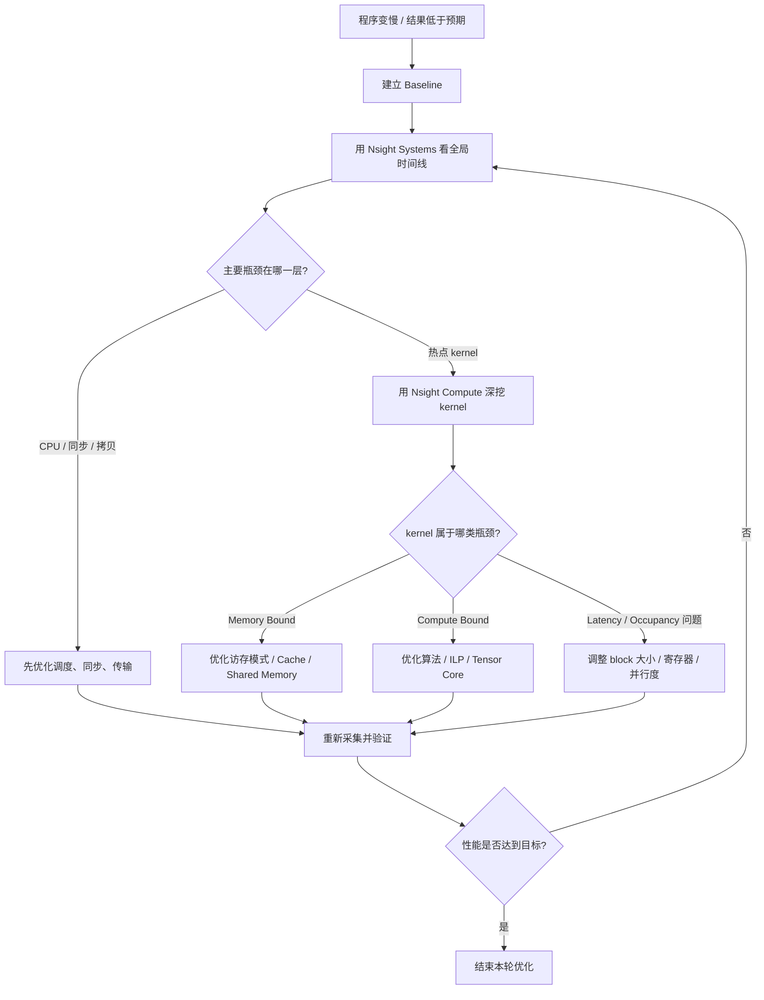
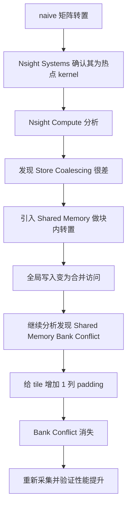
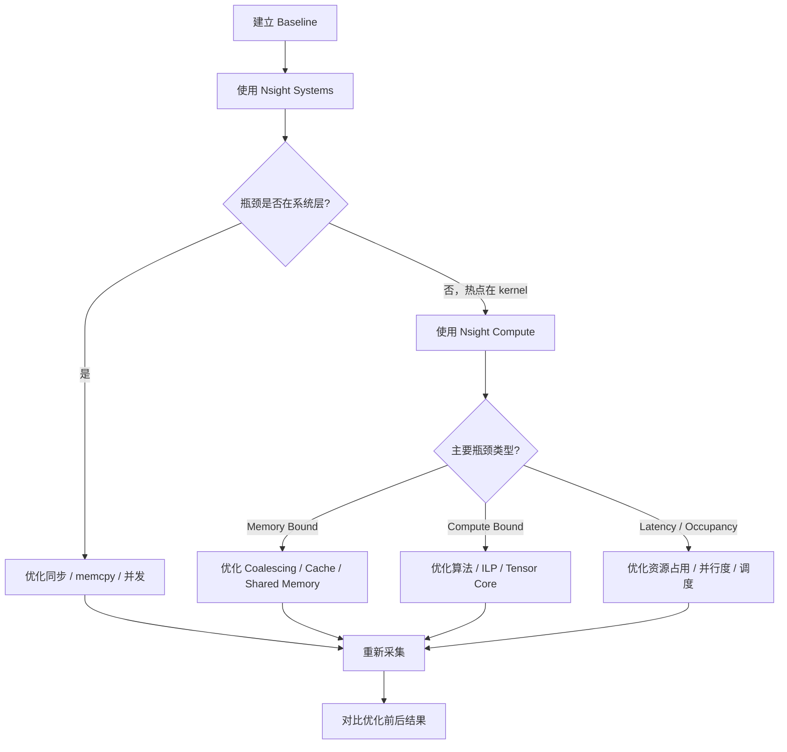

 CUDA 性能分析实战：Nsight Systems和Nsight Compute入门

> **系列**：CUDA修仙之路  
> **难度**：⭐⭐⭐ (1-5星)  
> **前置知识**：第5篇 - 第一个CUDA程序，第6篇 - SIMT执行模型  
> **预计阅读时间**：28分钟  
> **配套代码**：[GitHub链接](https://github.com/Mark930209/DaoOfCUDA)

---

# 引子：为什么需要性能分析？

**优化！优化！还是特么的优化！**
**快！快！要的就是特么的快！**

用CUDA写完一个程序不难，但要让它真正跑得快，难度直接上一个台阶。很多刚入门的同学会发现：代码编译通过了，结果也对了，但跑起来比CPU还慢。前面几篇介绍了CUDA编程模型和内存体系的理论基础，但在实际优化时，光靠理论远远不够——你得定位瓶颈具体在哪里。

比如下面这个 kernel：

```cuda
__global__ void my_kernel(float* data, int n) {
    int i = blockIdx.x * blockDim.x + threadIdx.x;
    if (i < n) {
        data[i] = expensive_computation(data[i]);
    }
}
```

跑起来以后，你只知道一件事：**它很慢**。但"慢"有很多种可能：

- GPU 大部分时间在空闲，CPU 喂不饱；
- Host ↔ Device 拷贝太频繁，数据传输成了瓶颈；
- kernel 本身是热点，而且可能是内存受限、计算受限或并行度不足。

如果没有分析工具，优化就退化成了"拍脑袋调参"。

NVIDIA 提供了两个核心分析工具：

- **`Nsight Systems`**：系统级分析工具，看全局时间线，回答"时间花到哪里去了"；
- **`Nsight Compute`**：kernel 级分析工具，深挖单个热点 kernel，回答"这个 kernel 为什么慢"。

本文要做的事情很清楚：**从一段真实的问题代码出发，用这两个工具一步步定位瓶颈并优化。**

---

# 1. 完整的优化工作流

在上手工具之前，先把整体思路理清楚。不管你的CUDA程序有多复杂，优化的标准流程都是下面这样：



一句话总结：**先看全局、再钻热点、每次优化后都重新验证**。

接下来按照这个流程，我们一步一步走。

---

# 2. 环境准备与工具安装

## 2.1 工具来源

`Nsight Systems` 和 `Nsight Compute` 在安装 CUDA Toolkit 时通常已附带。如果需要独立安装或升级到最新版本：

- **Nsight Systems**：从 [NVIDIA Nsight Systems 下载页](https://developer.nvidia.com/nsight-systems/get-started) 获取，下载页按日期版本组织（如 `2026.1.2`）。
- **Nsight Compute**：从 [NVIDIA Nsight Compute 下载页](https://developer.nvidia.com/tools-overview/nsight-compute/get-started) 获取。

> 使用前先确认下载页上的最新版本号和目标平台。独立安装的新版本通常比 Toolkit 附带的更全。

## 2.2 环境变量配置

安装完成后，需要确保命令行工具 `nsys` 和 `ncu` 能被正确调用。nsys默认安装在C:\Program Files\NVIDIA Corporation\Nsight Systems下，ncu默认安装在C:\Program Files\NVIDIA Corporation\Nsight Compute下，文件夹中会有对应的版本号。需要将对应的命令行工具路径添加到系统环境变量中。


在命令行中验证：

```bash
nvcc --version
nsys --version
ncu --version
```

三个命令都能正确输出版本信息，环境就绑好了。

> 对于Windows NSightSystems，nsys-ui.exe在host-windows-x64文件夹中，nsys在target-windows-x64文件夹中。

> 如果命令识别有问题，需要自己手动将对应的工具加入环境变量

## 2.3 host 与 target 的概念

- **host**：运行 GUI、查看报告的机器。
- **target**：实际运行被分析程序的机器。

最常见的两种情况：

1. 本机分析本机程序——host 和 target 是同一台机器；
2. Windows GUI 分析 Linux 服务器上的程序——Windows 是 host，Linux 是 target。

## 2.4 编译配套代码

本文配套两个示例程序，完整源码在 `code/` 目录。先编译好方便后面跟着跑：

**Linux / macOS**：

```bash
cd code
nvcc -O3 -lineinfo -o profile_demo profile_demo.cu
nvcc -O3 -lineinfo -o transpose_demo transpose_demo.cu
```

**Windows**（MSVC 默认以 GBK 解析源文件，需加 `/utf-8` 避免 C4819 警告）：

```bash
cd code
nvcc -O3 -lineinfo -Xcompiler /utf-8 -o profile_demo.exe profile_demo.cu
nvcc -O3 -lineinfo -Xcompiler /utf-8 -o transpose_demo.exe transpose_demo.cu
```

编译选项说明：

| 选项 | 作用 |
|---|---|
| `-O3` | 最高级别编译优化，贴近实际发布版本的性能表现 |
| `-lineinfo` | 在二进制中嵌入源码行号信息，让 `Nsight Compute` 能将指标关联到源码行 |
| `-Xcompiler /utf-8` | （仅 Windows）让 MSVC 以 UTF-8 解析源文件，消除 C4819 警告 |

> `-lineinfo` 基本不影响运行性能，但对性能分析至关重要。建议在分析阶段始终加上。

---

# 3. 建立 Baseline：没有基线，优化就是空谈

优化的第一步不是打开工具，而是**记录下程序现在有多慢**。如果不知道起点在哪，后面的任何改动都无法量化效果。

## 3.1 Baseline 应该记录什么

- 输入规模（例如 `N = 1 << 24`，约 1600 万个元素）
- GPU 型号、驱动版本、CUDA 版本
- 编译选项（`-O3 -lineinfo`）
- 关键 kernel 的平均执行时间
- 是否做了预热

## 3.2 配套示例：`profile_demo.cu`

`profile_demo.cu` 包含两个阶段，专门用来制造对比鲜明的 timeline：

**阶段 1：SAXPY 基线测量**

```cuda
__global__ void saxpy_kernel(float a, const float* x, const float* y, float* out, int n) {
    int i = blockIdx.x * blockDim.x + threadIdx.x;
    if (i < n) {
        out[i] = a * x[i] + y[i];
    }
}
```

这是一个标准的 SAXPY（$y = ax + b$）kernel，用 `cudaEvent` 计时，运行 20 次取均值。代码中包含预热步骤：

```cuda
// 预热：避免把 CUDA 上下文初始化等一次性开销算入正式测量
warmup_kernel<<<grid, block>>>(d_out, n);
cudaDeviceSynchronize();
```

第一次运行 CUDA kernel 时会触发上下文初始化、JIT 编译等一次性开销，不做预热会导致首次运行时间明显偏高，进而影响分析结论。

**阶段 2：故意写"烂"的小 kernel 密集调用**

```cuda
for (int i = 0; i < 200; ++i) {
    tiny_kernel<<<1, 256>>>(d_out, 256);
    cudaDeviceSynchronize();   // 每次都同步
}
```

这段代码连续启动 200 个极小的 kernel，每个只处理 256 个元素，而且**每次启动后都同步等待**。它并不是为了算什么有意义的结果，而是为了在 `Nsight Systems` 的 timeline 中制造一个非常经典的反面教材。

运行一下看看 baseline 输出：

```bash
./profile_demo
```

```text
[Baseline] saxpy average kernel time: 0.xxxx ms
Checksum(first 1024 elems): xxxxx
```

> 记住这个数字，后面所有优化都要和它对比。

---

# 4. 用 Nsight Systems 找系统级瓶颈

建好 baseline 以后，第一件事不是去分析某个 kernel 的指标，而是用 `Nsight Systems` 看看整个程序的时间都花在了哪里。

## 4.1 采集 timeline
> 注意: 默认仓库中目录有中文，建议将代码放到单独的无中文的目录中执行

> 注意： 在Windows下需要使用管理员权限运行nsys，否则无法获取完整信息，可能报AnalysisService: failed to start event source Perf: AccessDeniedException
```bash
nsys profile -o profile_demo_report ./profile_demo
```

参数说明：

| 参数 | 含义 |
|---|---|
| `profile` | 子命令，表示启动一次性能采集 |
| `-o profile_demo_report` | 输出文件名（自动生成 `.nsys-rep` 后缀） |
| `./profile_demo` | 要分析的目标程序 |

如果你只关心 CUDA 相关的活动，不想采集 CPU 采样信息（可以减小报告体积），可以用：

```bash
nsys profile --trace=cuda,nvtx --sample=none --cpuctxsw=none -o profile_demo_report ./profile_demo
```

其中 `--trace=cuda,nvtx` 表示只追踪 CUDA API 和 NVTX 标记，`--sample=none` 关闭 CPU 指令采样，`--cpuctxsw=none` 关闭 CPU 上下文切换追踪。

> 完整的命令行参数可参考 [Nsight Systems User Guide - CLI](https://docs.nvidia.com/nsight-systems/UserGuide/index.html)。

采集完成后用 GUI 打开报告：

```bash
nsys-ui profile_demo_report.nsys-rep
```
可以看到下面的分析结果：


## 4.2 读 Timeline：按层排查

打开时间线后，不要被满屏的信息吓到。按下面四步依次看：

### 第一步：GPU 有没有在干活

先看 GPU 行：如果出现大段空白，说明 GPU 在等 CPU。问题可能出在 kernel 启动太碎、同步太频繁或数据传输阻塞。


### 第二步：CPU 在干什么

看 CPU 线程上的 CUDA API 调用。如果 `cudaDeviceSynchronize` 或 `cudaMemcpy` 密集出现，往往就是同步阻塞导致 GPU 利用率低。


### 第三步：memcpy 和 kernel 的时间关系

如果 H2D → kernel → D2H 完全串行、没有重叠，说明数据传输本身就是瓶颈。


### 第四步：确认谁是真正的热点

只有当 GPU 一直很忙、总时间仍然长的时候，才需要进入 `Nsight Compute` 分析具体的 kernel。


> 阶段 1 中 saxpy 连续执行，GPU 利用率高；阶段 2 中 tiny_kernel 碎片化严重，GPU 大量空闲。

## 4.3 从 timeline 中发现的问题

对照 `profile_demo.cu` 的 timeline，应该能观察到明显的两段：

**阶段 1（SAXPY）**：kernel 连续执行 20 次，GPU 行上几乎没有空隙。这是正常的——多次 kernel 在同一个 stream 中背靠背提交，中间没有同步。

**阶段 2（tiny_kernel）**：每个 kernel 极短，但后面紧跟着一个 `cudaDeviceSynchronize`，导致 GPU 每执行一个微小 kernel 就停下来等 CPU。timeline 上 GPU 行会出现大量间隔。


这就是一个非常典型的问题模式：**kernel 本身没写错，但调度方式把 GPU 利用率拉到很低**。

## 4.4 常见现象速查表

| Timeline 现象 | 初步判断 | 下一步 |
|---|---|---|
| GPU 有大段空闲 | CPU 喂不饱 / 同步过多 | 检查 CPU 线程和同步调用 |
| memcpy 占比很大 | 数据传输成瓶颈 | 批处理、Pinned Memory、Async Copy |
| kernel 很碎 | launch overhead 高 | 合并 kernel / 增大批次 |
| 多 stream 仍串行 | 流使用方式有问题 | 检查依赖、默认流、同步点 |
| GPU 一直很忙，总时间仍长 | 热点 kernel 本身慢 | 进入 `Nsight Compute` |

---

# 5. 挑热点：不要分析所有 kernel

`Nsight Systems` 的 timeline 中可能出现大量 kernel，但不是每一个都值得优化。

优先分析满足以下条件的 kernel：

1. **总耗时占比高**——谁对总时间贡献最大，谁就是第一优先级；
2. **调用次数多**——单次很短但累计占比大的 kernel 同样值得关注；
3. **输入规模稳定、容易复现**——方便对比优化前后的指标。

> 常见误区：有些 kernel 看起来很复杂，但只跑一次；有些 kernel 很简单，但跑了几百万次。性能分析关心的始终是**对总时间的贡献**。

确认热点 kernel 后，记录下它的名称，然后只对这一个 kernel 做 `Nsight Compute` 分析。

---

# 6. 用 Nsight Compute 深挖热点 kernel

确认程序的主要时间确实花在某个 kernel 上之后，就可以用 `Nsight Compute` 进入微观分析了。

## 6.1 采集 kernel 指标

现在我们切换到矩阵转置示例 `transpose_demo.cu`。先跑一下看看 baseline：

```bash
./transpose_demo
```

```text
Matrix size: 4096 x 4096
naive      : x.xxxx ms, xxx.xx GB/s
shared     : x.xxxx ms, xxx.xx GB/s
optimized  : x.xxxx ms, xxx.xx GB/s
shared speedup over naive    : x.xxxx x
optimized speedup over naive : x.xxxx x
```


用 `Nsight Compute` 分析：
> 注意：同样记得使用管理员权限运行
```bash
ncu -o transpose_report ./transpose_demo
```

如果只想分析其中某个 kernel，可以用 `--kernel-name` 过滤：

```bash
ncu --kernel-name transpose_naive -o transpose_naive_report ./transpose_demo
```

要采集完整的指标集（包括 Roofline），必须使用 `--set full`：

```bash
ncu --set full -o transpose_full_report ./transpose_demo
```

> `--set full` 会让 kernel 重放更多次，采集时间明显变长，但能得到最完整的分析数据。日常分析建议先用默认 section，确认需要深挖时再切换 `--set full`。

用 GUI 打开报告：

```bash
ncu-ui transpose_report.ncu-rep
```

> 完整的命令行参数可参考 [Nsight Compute CLI 文档](https://docs.nvidia.com/nsight-compute/NsightComputeCli/index.html)。

## 6.2 看报告的正确顺序

`Nsight Compute` 的报告信息量很大，但不要试图一次看完所有指标。按下面的顺序逐层推进：

### 第一眼：Summary 和 Rules

新版 `Nsight Compute` 会在 Summary 页给出自动分析结论（Rules），直接告诉你这个 kernel 存在什么问题。虽然不能替代人工思考，但非常适合做"第一眼判断"。


### 第二眼：Speed Of Light (SOL)

这是判断 kernel 瓶颈类型的核心入口。读法：

- **Memory Throughput 高、SM Throughput 低** → Memory Bound（内存受限）
- **SM Throughput 高** → Compute Bound（计算受限）
- **两者都不高** → Latency / Occupancy 问题（延迟或并行度不足）


### 第三眼：Occupancy

需要强调一点：**Occupancy 不是越高越好**。

50% 的 Occupancy 不一定差，100% 也不一定更快。关键问题是：当前的 Occupancy 是否足以隐藏内存访问延迟。

常见的 Occupancy 限制因子：

- 寄存器数量（Registers per thread）
- Shared Memory 用量
- Block Size（每个 block 的线程数）


### 第四眼：Memory Workload Analysis

这部分回答：

- 全局内存读写是否合并（Coalesced）
- L1 / L2 命中率
- 带宽是否接近设备上限


### 第五眼：Warp Stall 与 Source

到这一步就可以定位到具体的源码行了：

| Stall 类型 | 含义 | 优化方向 |
|---|---|---|
| Memory Throttle / Long Scoreboard | 等内存返回 | 优化访存模式、缓存、Shared Memory |
| Execution Dependency | 指令间依赖长 | 增加 ILP、重排计算 |
| Barrier / Sync | `__syncthreads()` 过多 | 减少同步 |
| Not Selected / No Eligible | warp 不够 | 提升 Occupancy / 并行度 |


---

# 7. Roofline：判断优化方向的地图

很多文章把 Roofline 当成孤立的理论知识来讲，但实际上它更像一张"优化方向地图"：告诉你这个 kernel 理论上被什么卡住了。

## 7.1 核心概念：计算强度

$$
\text{Arithmetic Intensity} = \frac{\text{FLOPs}}{\text{Bytes Accessed}}
$$

也就是**每访问 1 字节数据，做了多少浮点运算**。

- 计算强度低 → 性能受内存带宽限制（Memory Bound）
- 计算强度高 → 性能受算力峰值限制（Compute Bound）

## 7.2 一个典型例子：向量加法

```text
c[i] = a[i] + b[i]
```

- 运算：1 次加法 = 1 FLOP
- 内存：读 `a[i]` + 读 `b[i]` + 写 `c[i]` = 12 字节（float 各 4 字节）

$$
\text{AI} = \frac{1}{12} \approx 0.083 \text{ FLOPs/Byte}
$$

如此低的计算强度，天然就是 Memory Bound。再怎么优化计算逻辑也没用，重点应该放在提高访存效率上。

如果 `Nsight Compute` 给出类似结果：

```text
SM Throughput: 12%
Memory Throughput: 85%
```

这组数据完全印证了上面的分析——绝大部分时间在等数据，而不是算不过来。

## 7.3 向量化加载：榨干带宽

对于 Memory Bound 的 kernel，一个常见的优化手段是**向量化加载**，用 `float4` 一次读取 16 字节：

```cuda
__global__ void vector_add_optimized(float4* a, float4* b, float4* c, int n) {
    int i = blockIdx.x * blockDim.x + threadIdx.x;
    if (i < n / 4) {
        float4 va = a[i];
        float4 vb = b[i];
        float4 vc;
        vc.x = va.x + vb.x;
        vc.y = va.y + vb.y;
        vc.z = va.z + vb.z;
        vc.w = va.w + vb.w;
        c[i] = vc;
    }
}
```

向量化不会改变"Memory Bound"的本质，但可以让内存带宽利用率更接近硬件上限。

## 7.4 在 Nsight Compute 中看 Roofline

> 注意： 一定要听使用--set full参数采集数据

新版 `Nsight Compute` 可以直接生成 `GPU Speed Of Light Roofline Chart`，核心用法：

- 看当前 kernel 的点落在图中哪个区域
- 如果点在左侧斜线下方（Memory Bound 区域），优先优化访存
- 如果点在右侧水平线下方（Compute Bound 区域），优先优化计算

> 有些 kernel 已经非常接近内存带宽上限（Roofline 的斜线天花板），继续优化的空间很小。这时候最正确的决定可能是：接受它的上限，把精力投入到收益更大的热点上。


---

# 8. 完整实战：优化矩阵转置

矩阵转置是 CUDA 优化的经典案例，因为它能把全局内存合并访问、Shared Memory 和 Bank Conflict 这几个核心问题串起来。

配套代码：`code/transpose_demo.cu`

## 8.1 版本一：朴素实现

```cuda
__global__ void transpose_naive(const float* in, float* out, int width, int height) {
    int x = blockIdx.x * blockDim.x + threadIdx.x;
    int y = blockIdx.y * blockDim.y + threadIdx.y;

    if (x < width && y < height) {
        out[x * height + y] = in[y * width + x];
    }
}
```

逻辑很直接：从 `in` 的 `(y, x)` 位置读数据，写到 `out` 的 `(x, y)` 位置。

**问题在哪？** 看内存访问模式：

- **读取端** `in[y * width + x]`：同一个 warp 的相邻线程（`threadIdx.x` 连续），访问的地址也连续 → **读取是合并的**。
- **写入端** `out[x * height + y]`：相邻线程写入的地址间隔为 `height`（跨行） → **写入是非合并的**。

非合并写入意味着一个 warp 的 32 个线程要写 32 个分散的内存位置，硬件只能拆成多个内存事务，效率极低。

用 `Nsight Compute` 分析，预期会看到：

```text
SM Throughput:    低
Memory Throughput: 中等

Global Store Throughput: 远低于 Global Load Throughput
```

这组数据直接印证：**瓶颈在全局写入的非合并访问**。


## 8.2 版本二：引入 Shared Memory

既然全局写入不连续，那就先把数据读到 Shared Memory 里做一次块内"转置"，再从 Shared Memory 以连续方式写回全局内存：

```cuda
constexpr int TILE_SIZE = 32;

__global__ void transpose_shared(const float* in, float* out, int width, int height) {
    __shared__ float tile[TILE_SIZE][TILE_SIZE];

    int x = blockIdx.x * TILE_SIZE + threadIdx.x;
    int y = blockIdx.y * TILE_SIZE + threadIdx.y;

    // 从全局内存读取到 Shared Memory（合并读取）
    if (x < width && y < height) {
        tile[threadIdx.y][threadIdx.x] = in[y * width + x];
    }
    __syncthreads();

    // 从 Shared Memory 读取（转置索引），写回全局内存（合并写入）
    x = blockIdx.y * TILE_SIZE + threadIdx.x;
    y = blockIdx.x * TILE_SIZE + threadIdx.y;

    if (x < height && y < width) {
        out[y * height + x] = tile[threadIdx.x][threadIdx.y];
    }
}
```

核心思想：**Shared Memory 的访问延迟远低于全局内存，用它做中转，把原来跨步的全局写变成连续写。**

优化后，全局 Store Throughput 会显著提升。但 `Nsight Compute` 可能同时报告一个新问题：**Shared Memory Bank Conflict**。


## 8.3 为什么会出现 Bank Conflict？

Shared Memory 被划分为 32 个 bank（对应一个 warp 的 32 个线程）。当一个 warp 中的多个线程同时访问**同一个 bank 的不同地址**时，这些访问必须串行化，就产生了 Bank Conflict。

在 `transpose_shared` 中，写入时按 `tile[threadIdx.y][threadIdx.x]` 访问（行优先），但读取时变成了 `tile[threadIdx.x][threadIdx.y]`（列优先）。列访问时，`threadIdx.x = 0, 1, 2, ..., 31` 对应的地址分别是 `tile[0][threadIdx.y]`, `tile[1][threadIdx.y]`, ...，步长恰好是 32，而 32 × 4 bytes = 128 bytes，正好是 bank 周期。所以 warp 中的所有线程全部撞到同一个 bank。

## 8.4 版本三：Padding 消除 Bank Conflict

解决方法出奇地简单——给 Shared Memory 的行宽加 1：

```cuda
__shared__ float tile[TILE_SIZE][TILE_SIZE + 1];   // +1 padding
```

这一个 `+1` 把每行的实际宽度从 32 变成了 33。列访问时步长变成 33 × 4 = 132 字节，不再是 bank 周期的整数倍，线程就会分散到不同的 bank，冲突消失。

```cuda
__global__ void transpose_optimized(const float* in, float* out, int width, int height) {
    __shared__ float tile[TILE_SIZE][TILE_SIZE + 1];

    int x = blockIdx.x * TILE_SIZE + threadIdx.x;
    int y = blockIdx.y * TILE_SIZE + threadIdx.y;

    if (x < width && y < height) {
        tile[threadIdx.y][threadIdx.x] = in[y * width + x];
    }
    __syncthreads();

    x = blockIdx.y * TILE_SIZE + threadIdx.x;
    y = blockIdx.x * TILE_SIZE + threadIdx.y;

    if (x < height && y < width) {
        out[y * height + x] = tile[threadIdx.x][threadIdx.y];
    }
}
```


## 8.5 三个版本对比

| 版本 | 主要问题 | 关键改动 | 预期指标变化 |
|---|---|---|---|
| `transpose_naive` | 全局写入非合并 | — | Store Throughput 低 |
| `transpose_shared` | Bank Conflict | 引入 Shared Memory 做块内转置 | Global Store 提升；Shared Memory 冲突出现 |
| `transpose_optimized` | 问题解决 | `tile[32][33]`（+1 padding） | Bank Conflict 消失，带宽接近上限 |

用 `Nsight Compute` 分别分析三个版本，验证上面的判断：

```bash
ncu --kernel-name transpose_naive -o naive_report ./transpose_demo
ncu --kernel-name transpose_shared -o shared_report ./transpose_demo
ncu --kernel-name transpose_optimized -o optimized_report ./transpose_demo
```

## 8.6 流程回顾



---

# 9. 总结：一套可执行的优化工作流

## 核心操作流程



## 速查表

| 现象 | 工具 | 重点看什么 | 常见行动 |
|---|---|---|---|
| GPU 利用率低 | Nsight Systems | Timeline、同步、Memcpy | overlap、减少同步、合并小任务 |
| 某个 kernel 很慢 | Nsight Compute | SOL、Occupancy、Warp Stall | 定向优化热点 kernel |
| 怀疑访存模式差 | Nsight Compute | Coalescing、Cache、Shared Memory | 重组数据布局、使用 Shared Memory |
| 不确定优化空间 | Roofline | 点位与天花板距离 | 判断理论上限与投入产出 |

## 核心要点

1. **先 Systems，后 Compute**——先确认慢在 CPU、拷贝还是 GPU，再深挖具体 kernel。
2. **Occupancy 不是越高越好**——关键看能否隐藏延迟。
3. **Roofline 是方向图**——帮你判断该优先攻内存还是算力。
4. **优化必须闭环**——Baseline → 分析 → 优化 → 回归验证。

---

# 思考题

1. **为什么"GPU 利用率低"并不一定说明 kernel 写得差？**
2. **矩阵转置中，Shared Memory 为什么能解决全局写入问题，但又引入了 Bank Conflict？** `+1` padding 的原理是什么？
3. **一个 kernel 的 SM Throughput 和 Memory Throughput 都不高，这意味着什么？**

# 动手练习

1. 用 `Nsight Systems` 分析 `profile_demo`，找到阶段 2 的 timeline 问题，并截图记录。
2. 用 `Nsight Compute` 分别分析矩阵转置的三个版本，记录 Global Store Throughput 和 Bank Conflict 指标的变化。
3. 如果你有自己的 CUDA 程序，给它建立一份 Baseline 记录表，然后走一遍完整的分析流程。

---

# 参考资料

[Nsight-Systems] NVIDIA. *Nsight Systems User Guide*. https://docs.nvidia.com/nsight-systems/UserGuide/index.html

[Nsight-Compute] NVIDIA. *Nsight Compute User Guide*. https://docs.nvidia.com/nsight-compute/NsightCompute/index.html

[Nsight-Systems-GetStarted] NVIDIA. *Get Started With Nsight Systems*. https://developer.nvidia.com/nsight-systems/get-started

[Nsight-Compute-GetStarted] NVIDIA. *Download NVIDIA Nsight Compute*. https://developer.nvidia.com/tools-overview/nsight-compute/get-started

[Roofline] Williams, S., et al. (2009). *Roofline: An Insightful Visual Performance Model for Multicore Architectures*. Communications of the ACM.

[CUDA-Best-Practices] NVIDIA. *CUDA C++ Best Practices Guide*. https://docs.nvidia.com/cuda/cuda-c-best-practices-guide/

[配套代码说明] 本文示例代码使用说明：`code/README.md`

---

# 下期预告

**第8篇：入门综合实战：GPU加速图像处理 Pipeline**

下一篇会把前面学到的内容串起来：多阶段图像处理流程如何映射到 GPU、多个 kernel 如何协同、如何分析整条 pipeline 的瓶颈。

我们下期见。

---

*本文是《CUDA修仙之路》系列的第7篇，共38篇*  
*最后更新：2026年4月9日*
